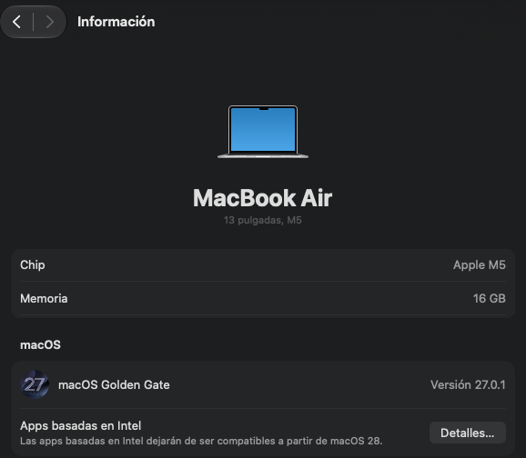
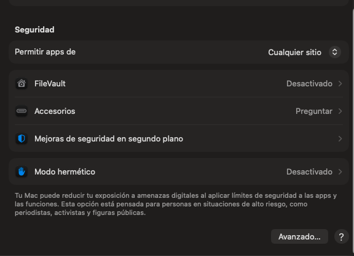
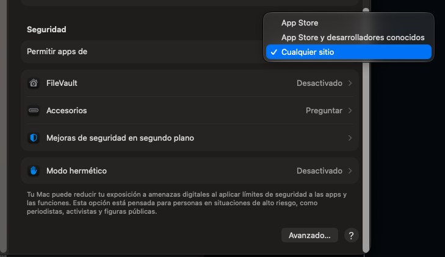
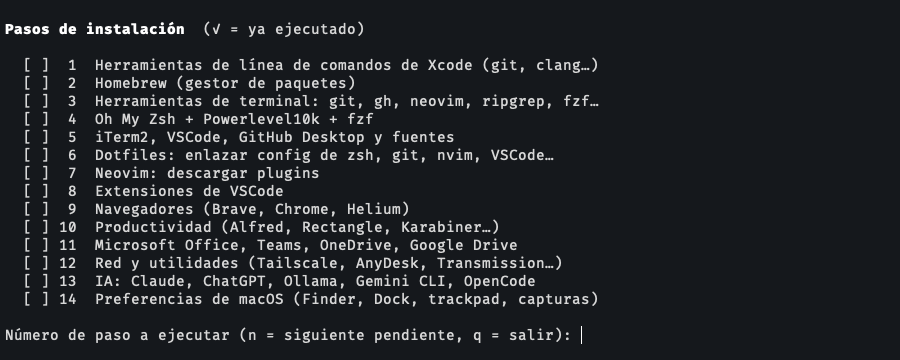

<p align="center">

</p>

---

<p align="center">
  <a href="https://github.com/yorbimv/macos">Inicio</a>
  &nbsp;&nbsp;&nbsp;|&nbsp;&nbsp;&nbsp;
  <a href="https://github.com/yorbimv/macos/tree/main/01-sistema">Sistema</a>
  &nbsp;&nbsp;&nbsp;|&nbsp;&nbsp;&nbsp;
  <a href="https://github.com/yorbimv/macos/tree/main/02-aplicaciones">Apps</a>
  &nbsp;&nbsp;&nbsp;|&nbsp;&nbsp;&nbsp;
  <a href="https://github.com/yorbimv/macos/tree/main/03-dev-environment">Dev</a>
  &nbsp;&nbsp;&nbsp;|&nbsp;&nbsp;&nbsp;
  <a href="https://github.com/yorbimv/macos/tree/main/troubleshooting">Soluciones</a>
</p>

---

# macOS - Inicio

> Probado en macOS 27.0.1 (26A434) · MacBook Air M5 (Apple Silicon)

## Introducción

Guía detallada para dejar un MacBook **listo para trabajar desde cero**. Si acabas de sacar el equipo de la caja (o cambiaste de computadora) aquí está todo lo necesario: actualizar el sistema, instalar aplicaciones, montar el entorno de desarrollo, productividad e IA local.

Sigue los pasos **en orden** y al terminar tendrás el mismo entorno que describe este repositorio. Todos los enlaces, comandos y archivos de configuración viven aquí mismo.

## Requisitos

- **Hardware:** Mac con Apple Silicon (M1 o superior).
- **Sistema:** macOS 27 (Tahoe) o superior, recién instalado.
- **Apple ID** para iCloud.
- **Cuenta de GitHub**, para clonar este repo y subir cambios (`gh auth login`).
- **Cuenta de Microsoft**, para Office 365 y OneDrive.
- **Internet estable**: iCloud puede tardar horas en sincronizar.
- **Ubicación del repo**: clonar en `~/Documents/GitHub/macos`, para que las rutas de Oh My Zsh (alias `github`, dotfiles) se mantengan.

<details>
<summary>Imagen 1: Información de la MacBook</summary>

<p align="center">

</p>

</details>

## Índice

La guía se divide en estas secciones. Cada una indica su paso equivalente en `install.sh`:

| #   | Sección                                   | Descripción                                       |
| --- | ----------------------------------------- | ------------------------------------------------- |
| 01  | [🖥️ Sistema](01-sistema/)                 | Preferencias del sistema                          |
| 02  | [📦 Aplicaciones](02-aplicaciones/)       | Homebrew, apps esenciales, inventario completo    |
| 03  | [💻 Dev Environment](03-dev-environment/) | iTerm2, Zsh, Git, Neovim, VSCode                  |
| 04  | [⚡ Productividad](04-productividad/)     | Cuentas, Office 365, OneDrive, email, navegadores |
| 05  | [🤖 IA Local](05-ia-local/)               | OpenCode, Gemini, Ollama, archivos de contexto    |

## Primeros pasos

_Se hacen a mano en ambos caminos (automático y manual), antes de instalar nada._

### Actualizar a la versión más reciente

1. Ir a Ajustes del Sistema
2. Ir a General / Actualización de Software
3. Instalar la última versión disponible y reiniciar

### Loguearse en iCloud

1. Ir a Ajustes del Sistema
2. Login con la cuenta de iCloud
3. Ir a Ajustes del Sistema / Apple ID / iCloud
   - Activar **"Carpetas Escritorio y Documentos"**
4. Una vez realizado, proceder a configurar **Mail y Fotos**
5. Se sincronizarán todos los archivos.
   - Esperar unas **horas** a que se descargue
   - Reiniciar Equipo y ya deben aparecer los archivos

### Habilitar instalación de apps de terceros

_Permite instalar aplicaciones de "Cualquier Sitio"_

```bash
sudo spctl --master-disable
```

> Después, activar la opción **"Cualquier sitio"** en Ajustes del Sistema / Privacidad y seguridad.
> Si no aparece, abrir cada app con **Abrir de todos modos** en esa misma pantalla.
> Esto reduce la protección de Gatekeeper; para volver a activarla: `sudo spctl --global-enable`

<p align="center">
<sub><b>1. Permitir apps de: "Cualquier sitio"</b></sub><br/>

</p>

<p align="center">
<sub><b>2. Seleccionar "Cualquier sitio" en el menú</b></sub><br/>

</p>

> Después de reiniciar el equipo continuar con lo siguiente

## Instalación

_Elige el camino: **automático** con `install.sh`, o **manual** siguiendo las secciones 01 a 05._

|                  | 🤖 Automática                                        | 📖 Manual                                         |
| ---------------- | ---------------------------------------------------- | ------------------------------------------------- |
| **Para quién**   | Equipo nuevo, quieres avanzar rápido                 | Quieres entender o ajustar cada cosa              |
| **Cómo**         | `./install.sh`: menú de 14 pasos, uno a la vez       | Secciones 01 a 05, en orden                       |
| **Control**      | Cada paso muestra lo que instala y pide confirmar    | Tú copias y ejecutas cada comando                 |
| **Ver sección**  | [Instalación automática](#instalación-automática)    | [Instalación manual](#instalación-manual)         |

### Instalación automática

_Un menú interactivo: tú eliges qué paso ejecutar y confirmas cada instalación antes de que ocurra_

```bash
xcode-select --install
git clone https://github.com/yorbimv/macos.git ~/Documents/GitHub/macos
cd ~/Documents/GitHub/macos && ./install.sh
```

<p align="center">

</p>

| Comando              | Qué hace                                      |
| -------------------- | --------------------------------------------- |
| `./install.sh`       | Menú: elige un número, `n` = siguiente, `q` = salir |
| `./install.sh 3`     | Ejecuta solo el paso 3                        |
| `./install.sh list`  | Muestra los pasos y cuáles ya hiciste         |

- Antes de instalar, cada paso **muestra la lista** de lo que va a instalar y pregunta `[s/N]`.
- Los dotfiles se enlazan **uno por uno** y se respalda lo que ya exista (`*.bak-<fecha>`).
- Las apps están separadas por categoría en [`brewfiles/`](brewfiles/): edita el archivo para quitar lo que no quieras.

### Instalación manual

_Para entender qué hace cada paso, o hacerlo a mano, continuar con las secciones (cada una indica su paso de `install.sh`)_

- [🖥️ Sistema](01-sistema/)
- [📦 Aplicaciones](02-aplicaciones/)
- [💻 Dev Environment](03-dev-environment/)
- [⚡ Productividad](04-productividad/)
- [🤖 IA Local](05-ia-local/)

## Qué incluye

| Área          | Herramientas                                                          |
| ------------- | --------------------------------------------------------------------- |
| Terminal      | iTerm2, zsh con Oh My Zsh + Powerlevel10k, fzf, lsd, ripgrep          |
| Editores      | Neovim (Lua + lazy.nvim, LSP, Telescope), VSCode con extensiones      |
| Git           | git, GitHub CLI, GitHub Desktop, alias                                |
| Productividad | Alfred, Rectangle, Karabiner, Office 365, OneDrive, Google Drive      |
| IA            | Claude, ChatGPT, Ollama, Gemini CLI, OpenCode                         |
| Sistema       | Preferencias de Finder, Dock, trackpad y capturas                     |

---

## Verifica que quedó bien

- [ ] `./install.sh list` muestra los pasos que hiciste con ✓
- [ ] Abres una terminal nueva y ves el prompt de Powerlevel10k con iconos
- [ ] `nvim` abre sin errores
- [ ] `brew doctor` no reporta problemas importantes
- [ ] Desktop y Documentos aparecen sincronizados con iCloud

---

## Mantener el repo al día

- Nueva app o CLI → agrégala al archivo que corresponda en [`brewfiles/`](brewfiles/).
- Los dotfiles son symlinks: editar `~/.zshrc` o `~/.config/nvim` ya modifica el repo, solo haz commit.

---

**Problemas comunes y soluciones en [troubleshooting/](troubleshooting/)**
**Última actualización:** Octubre 2026

---

> Continúa con las secciones en el orden que marca el [Índice](#índice).
