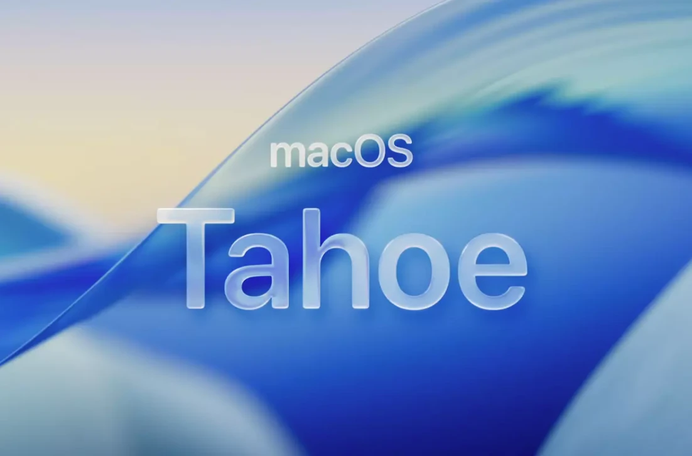

<p align="center">

</p>

---

<p align="center">
  <a href="https://github.com/yorbimv/macos">Inicio</a>
  &nbsp;&nbsp;&nbsp;|&nbsp;&nbsp;&nbsp;
  <a href="https://github.com/yorbimv/macos/tree/main/01-sistema">Sistema</a>
  &nbsp;&nbsp;&nbsp;|&nbsp;&nbsp;&nbsp;
  <a href="https://github.com/yorbimv/macos/tree/main/02-aplicaciones">Apps</a>
  &nbsp;&nbsp;&nbsp;|&nbsp;&nbsp;&nbsp;
  <a href="https://github.com/yorbimv/macos/tree/main/03-dev-environment">Dev</a>
  &nbsp;&nbsp;&nbsp;|&nbsp;&nbsp;&nbsp;
  <a href="https://github.com/yorbimv/macos/tree/main/troubleshooting">Soluciones</a>
</p>

---

# macOS - Inicio

> Probado en macOS 27.0.1 (26A434) · MacBook Air M5 (Apple Silicon)

Sigue las secciones en orden:

| #   | Sección                                   | Descripción                                       |
| --- | ----------------------------------------- | ------------------------------------------------- |
| 01  | [🖥️ Sistema](01-sistema/)                 | Preferencias del sistema                          |
| 02  | [📦 Aplicaciones](02-aplicaciones/)       | Homebrew, apps esenciales, inventario completo    |
| 03  | [💻 Dev Environment](03-dev-environment/) | iTerm2, Zsh, Git, Neovim, VSCode                  |
| 04  | [⚡ Productividad](04-productividad/)     | Cuentas, Office 365, OneDrive, email, navegadores |
| 05  | [🤖 IA Local](05-ia-local/)               | OpenCode, Gemini, Ollama, archivos de contexto    |

---

### 1. Primeros pasos

> Una vez instalado el sistema (Mac con Apple Silicon), ejecutar lo siguiente en orden:

##### Actualizar Sistema

1. Ir a Ajustes del Sistema
2. Ir a General / Actualización de Software

##### Loguearse en iCloud

1. Ir a Ajustes del Sistema
2. Login en iCloud
3. Ir a Ajustes del Sistema / Apple ID / iCloud
   - Activar **"Carpetas Escritorio y Documentos"**
4. Una vez realizado, proceder a configurar **Mail y Fotos**
5. Se sincronizarán todos los archivos.
   - Esperar unas **horas** a que se descargue
   - Reiniciar Equipo y ya deben aparecer los archivos

> Después de reiniciar el equipo continuar con lo siguiente

### 2. Instalación automática

_Instala Homebrew, todas las apps del `Brewfile`, Oh My Zsh y enlaza los dotfiles_

```bash
xcode-select --install
git clone https://github.com/yorbimv/macos.git ~/Documents/GitHub/macos
cd ~/Documents/GitHub/macos && ./install.sh
```

> `install.sh` se puede volver a correr sin problema. Usa `./install.sh --no-apps` para omitir la instalación de apps.

| Paso                        | Qué hace                                                                                  |
| --------------------------- | ----------------------------------------------------------------------------------------- |
| Homebrew                    | Lo instala si falta                                                                       |
| `Brewfile`                  | CLI, apps, fuentes y extensiones de VSCode                                                |
| Oh My Zsh                   | Con Powerlevel10k y fzf                                                                   |
| `dotfiles/`                 | Symlinks a `~/.zshrc`, nvim, git, VSCode… (respalda lo existente como `*.bak-<fecha>`)   |
| `scripts/macos-defaults.sh` | Finder, Dock, trackpad, capturas                                                          |

### 3. Instalación manual

_Si prefieres ir paso a paso, o para entender qué hace cada cosa, continuar con las secciones_

- [🖥️ Sistema](01-sistema/)
- [📦 Aplicaciones](02-aplicaciones/)
- [💻 Dev Environment](03-dev-environment/)
- [⚡ Productividad](04-productividad/)
- [🤖 IA Local](05-ia-local/)

---

### Mantener el repo al día

- Nueva app o CLI → agrégala al [`Brewfile`](Brewfile). `brew bundle cleanup --file=Brewfile` muestra lo instalado que no está listado.
- Los dotfiles son symlinks: editar `~/.zshrc` o `~/.config/nvim` ya modifica el repo, solo haz commit.

---

**Problemas comunes y soluciones en [troubleshooting/](troubleshooting/)**
**Última actualización:** Octubre 2026
